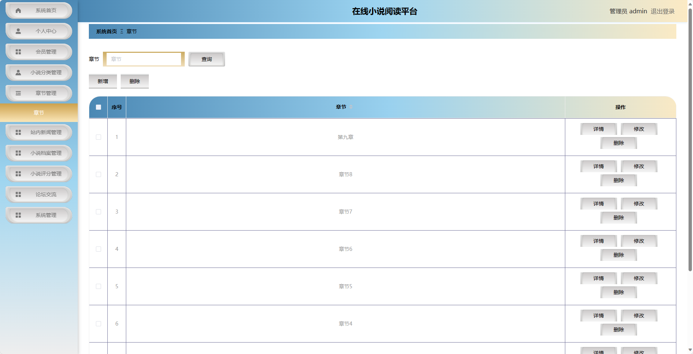

基于SpringBoot的在线小说阅读平台
=
- 完整代码获取地址：从戎源码网 ([https://armycodes.com/](https://armycodes.com/))
- 作者微信：19941326836  QQ：952045282 
- 承接计算机毕业设计、Java毕业设计、Python毕业设计、深度学习、机器学习
- 选题+开题报告+任务书+程序定制+安装调试+论文+答辩ppt 一条龙服务
- 所有选题地址https://github.com/nature924/allProject

一、项目介绍
---
基于Spring Boot框架实现的在线小说阅读平台，系统包含两种角色：管理员、用户,系统分为前台和后台两大模块，主要功能如下。

### 前台模块：
- 首页：展示站内新闻、精选小说推荐等内容。
- 站内新闻：展示平台的最新动态和公告信息。
- 小说档案：提供小说的分类列表和搜索功能。
- 论坛交流：用户可以在论坛上讨论小说、分享阅读心得等。
- 新闻公告：展示平台发布的新闻和公告信息。
- 个人中心：用户可以管理个人信息，查看已购买的小说、参与的论坛话题等。

### 后台模块：
### 管理员角色：
- 个人中心：管理员可以管理个人信息，修改密码等。
- 会员管理：管理员可以管理用户信息，包括添加、编辑和删除用户信息。
- 小说分类管理：管理员可以管理小说的分类信息，包括添加、编辑和删除分类。
- 章节管理：管理员可以管理小说的章节信息，包括添加、编辑和删除章节。
- 站内新闻管理：管理员可以管理站内新闻信息，包括添加、编辑和删除新闻。
- 小说档案管理：管理员可以管理小说的信息，包括添加、编辑和删除小说。
- 小说评分管理：管理员可以管理用户对小说的评分信息，包括查看和删除评分。
- 论坛交流：管理员可以管理论坛话题和回复，包括删除不当内容。
- 系统管理：管理员可以管理系统的相关配置，包括日志管理、权限管理等。

二、项目技术
---
- 编程语言：Java
- 数据库：MySQL
- 项目管理工具：Maven
- 前端技术：VUE、HTML、Jquery、Bootstrap
- 后端技术：Spring、SpringMVC、MyBatis

三、运行环境
---
- 操作系统：Windows、macOS都可以
- JDK版本：JDK1.8以上都可以
- 开发工具：IDEA、Ecplise、Myecplise都可以
- 数据库: MySQL5.7以上都可以
- Tomcat：任意版本都可以
- Maven：任意版本都可以

四、运行截图
---

### 程序截图：

